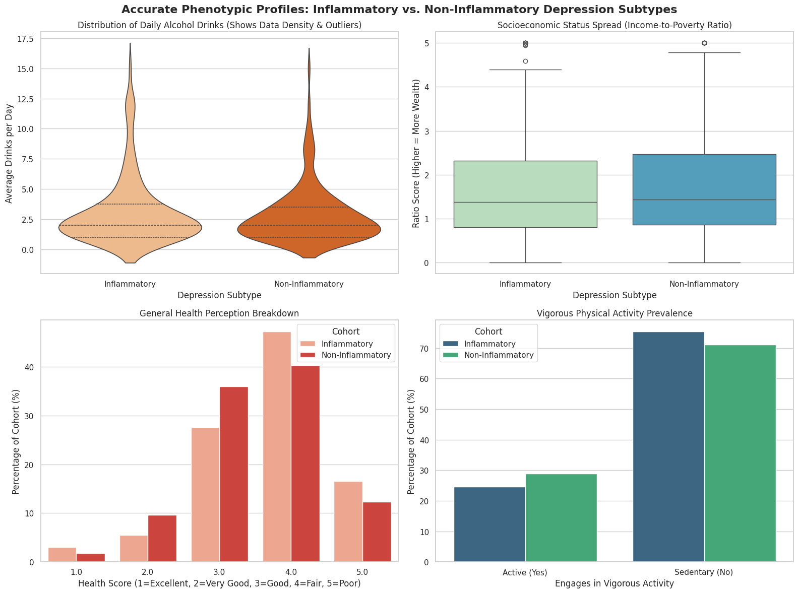

# Stratifying Depression Subtypes via Systemic Inflammation

## The Problem
* **The Challenge:** Over 30% of patients with Major Depressive Disorder do not respond to standard SSRI antidepressants because depression is treated as a single, uniform condition.
* **The Solution:** Clinical research suggests a distinct biological subtype exists: Inflammatory Depression. 
* **The Goal:** This project analyzes NHANES data to separate depressed cohorts into distinct biological biotypes (high vs. low inflammation) and identifies the underlying behavioral and socioeconomic factors that define them.

---

## Key Findings

Using clinical thresholds (PHQ-9 score >= 10 for depression; High-Sensitivity CRP > 3.0 mg/L for high inflammation), the sample was split into two balanced cohorts: 199 Inflammatory patients and 228 Non-Inflammatory patients.

### Metric Comparisons Matrix

While analyzing the data matrix above, clear lifestyle and economic trends emerged between the two groups:
* **Subjective Symptoms:** Sleep duration and sleep quality scores showed no significant variation between the two tracked cohorts, proving subjective sleep issues don't differentiate the biotypes.
* **Socioeconomic Stress:** The Inflammatory group had a lower Income-to-Poverty Ratio (1.74 vs. 1.84), pointing to financial strain as a chronic driver of physiological inflammation.
* **Physical Health Perception:** Patients with high inflammation reported worse self-perceived general health (3.69 vs. 3.52 on a 1-5 scale where 5 is poor).
* **Substance Use Skew:** Violin plot analysis showed that while the median alcohol intake was identical (2.0 drinks/day), the Inflammatory cohort contained a heavy concentration of severe drinking outliers, highlighting alcohol consumption as a direct mechanical trigger for high CRP.

---

## Recommendations

1. **Incorporate Blood Panels:** Psychiatric intake processes should combine traditional behavioral questionnaires (PHQ-9) with baseline blood work (hs-CRP) to immediately flag the inflammatory subtype.
2. **Targeted Treatment Paths:** Because the inflammatory cohort is heavily impacted by alcohol usage and socioeconomic stress, their treatment plans should prioritize integrated lifestyle counseling alongside standard care.
3. **Clinical Trial Stratification:** Clinical researchers should isolate patients meeting these exact criteria (PHQ-9 >= 10, CRP > 3.0) when testing anti-inflammatory agents as secondary treatments for depression.

---

## AI Workflow
This project paired human analysis with AI efficiency to accelerate data engineering tasks:

* **Schema Mapping:** AI was used to parse NHANES codebooks, automatically remapping categorical values and clearing missing or refused data flags.
* **Data Visualization:** The workflow leveraged AI feedback to build violin plots and stratified percentage distributions to accurately display population density and data skewness.
